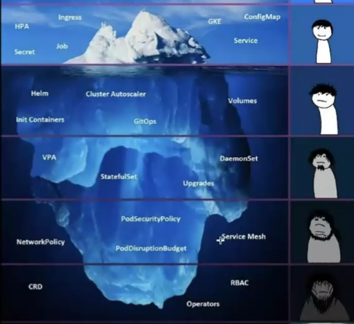
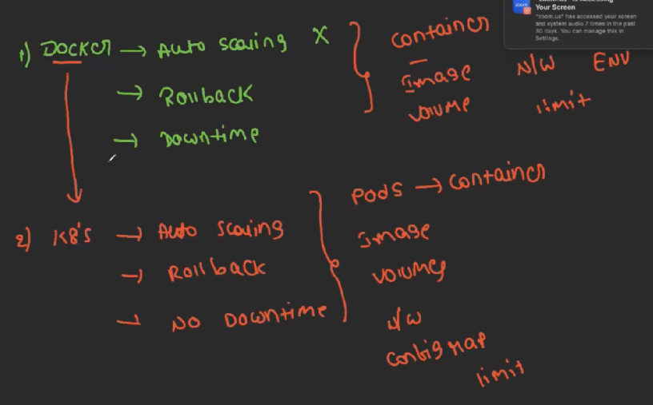
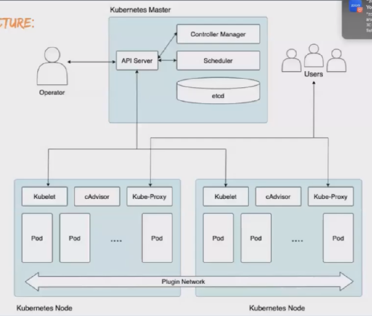

We will cover these topics in Kubernetes:

Why we use K8S rather than docker :
1. Auto scaling: To increse the containers automatically if needed.
 Docker dont have autoscaling and Kubernets have 
2. Roll-Back: we can just rollback to pervious version not like we can go from 1 to 4 or 4 to 6
3. DownTime: if we rollback or update image there will be a downtime.

If we deploy the application using K8s we can overcome all the above features and we will have all the features of docker.

-->In docker we used to deploy app in containers and then run the application on container 
In K8s we will create PODS and will have containers it will be as extra layer on top of container

---> Both have images & Networks

---> Both have volumes but we have higher volumes in K8s

--> Docker we have Env varibles but K8s have config Map.

--> we can set limits in both the docker and K8s

Check the Kubernetes Arch: IMP

1. It has Master(Brain) and Nodes(workers)
2. In Master it 4 parts:   
    1. API Server: Take request from operator. From operator API server will take response and give to Scheduler.
    2. Controller Manager : It will take rqst from api server. It will decide where to create a POD in w1 or w2. Based on the 1.noof pods 2. Size of pods.
        It will decide by getting the info from API server --> Kublets 
        Once it confirms it will sends to API Server then it will automatically create a POD in node
    3. Scheduler: 3Types Node Monitor Period: 5sec 
             1. Replication Controller --> It will automatically create if any POD deleted
             2. Node Controller ---> If any Worker Node deleted it will create
             3. Service Controller ---> To create services automatically if anything deleted
    4. etcd: Its is a database when a POD created or delete all the info regarding cluster will be there in KeyValue Format. Only API server can access the etcd. 
3.  In Worker Node: 
    1. Kubelet: It has all the info of the POD 
    2. Kube-Proxy: It will have all the info related to networking information.
    and networking configuration. 58mins
    Helps to maintain connection b/n worker servers
    3. POD: 

Kubernetes Cluster Setup: 2 Types
1. Self Manager K8s Cluster
    --> In real time we use multi Node 
    1. Mini kube (Single Node Cluster) 
    ---> Single server will have master and worker
         we use MiniKube tool to create it
    2. Kubeadm (Multi Node cluster)
    ---> Mulitple Servers have master and workers 
         We use KOPS(kubernetes operation),K3D,etc.. tools to create multi
    3. KOPS 
2. Cloud Managed K8s Cluster
    1. Aws EKS
    2. Azure AKs
    3. GCP GKS
    4. IBM IKE

