Take script from all setips and run ubuntu minikube

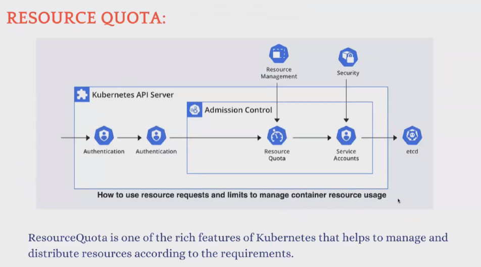

Create a POD -->pod.yml
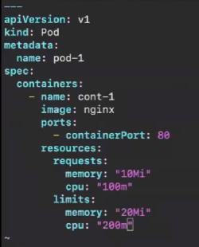
create --> kubectl create -f pod.yml
get --> kubectl get po
describe --> kubectl describe pod pod-1
We can see limits & requests in this 

Now we can remove limits keep only requests
for pod2--> Its not a good way beacuse it will use more space
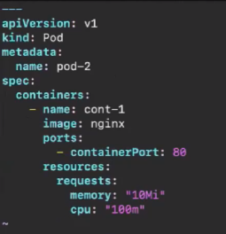
create pod --> kubectl create -f pod.yml

Now we keep only limits and remove requests
for pod3 -->
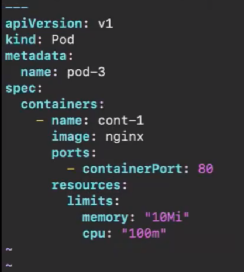
create pod --> kubectl create -f pod.yml

We call delete all pods now --> kubectl delete po --all

Now we can do realtime -->
Create a namespace and for that namespace allocate a resource quota and creating pods in that

create ns --> kubectl create ns dev
              kubectl create ns test
create file --> rq.yml
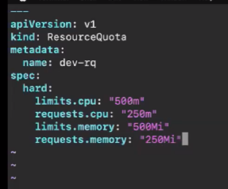
create --> kubectl create -f rq.yml -n dev
see --> kubectl get ns
describe --> kubectl describe ns dev

now we need to create pods in ns and it needs limits & requests
opne --> pod.yml
need to give resources-->
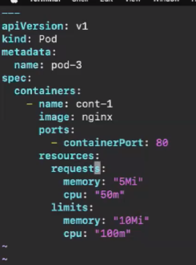
it is pod-1 
create --> kubectl create -f pod.yml -n dev
Now again describe ns --> kubectl describe ns dev
We can creaete pods by calculating 

If we want to change the limits then delete pod and apply

RBAC---> Role Based Access Control
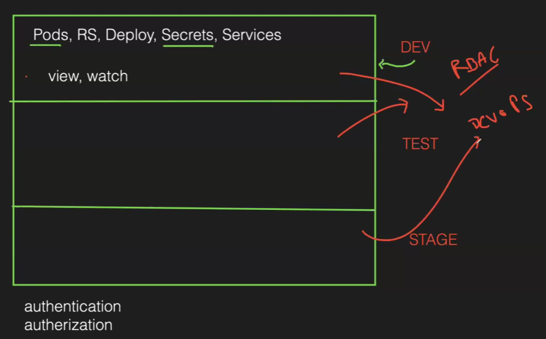
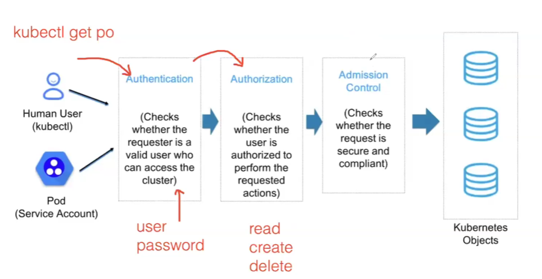

role-binding --> acess for 1 ns
cluster role binding --> acess for all cluster ns 
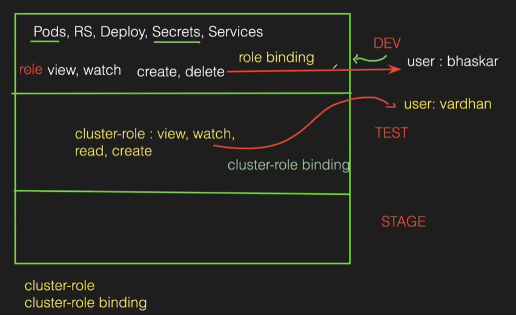

We need to implement this -->
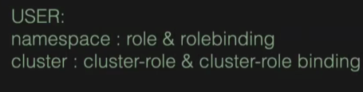

To create a user in K8s we need certifications
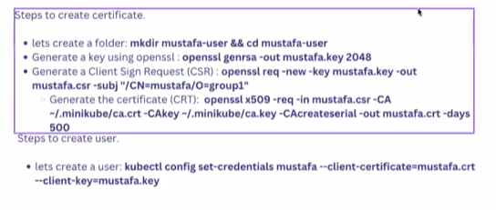

Now create folder --> mkdir phani-user && cd phani-user
Now 2nd openssl --> openssl genrsa -out mustafa.key 2048
Generate a Client Sign Request (CSR) --> openssl req -new -key mustafa.key -out

follow the steps: you need to see user created
Follow vedio --> 1h.10mins
we need to see context to see --> kubectl config view
Now we need to create a context with name --> kubectl config set-context my-context -- cluster=minikube -- user=mustafa

Now we do rbac --> 
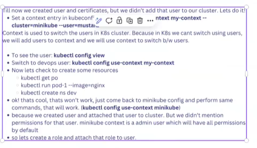
1st create role and nxt role binding -->
role.yml --->
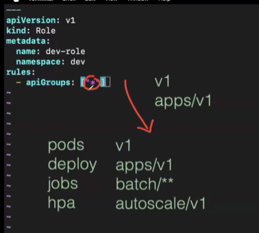
role and role bidnig--> 
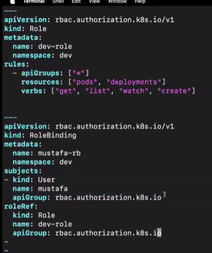
kubectl create -f role.yml
now we need to see in which context --> kubectl config view | grep -i "current-context"
To change --> kubectl config use-context my-context
Now we can check for pods which didmt have access --> kubectl get po
We only have peermision for dev env of pods --> kubectl get po -n dev

To change eveything we goto admin--> kubectl config iuse-context minikube
check for which context we are in ---> kubectl config view | rep -i "current-context"
open rc.yml --> we can add services in resoucrs
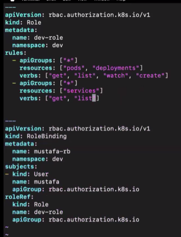
Now apply --> kubectl apply -f rc.yml
 now we checkby changing context --> 
 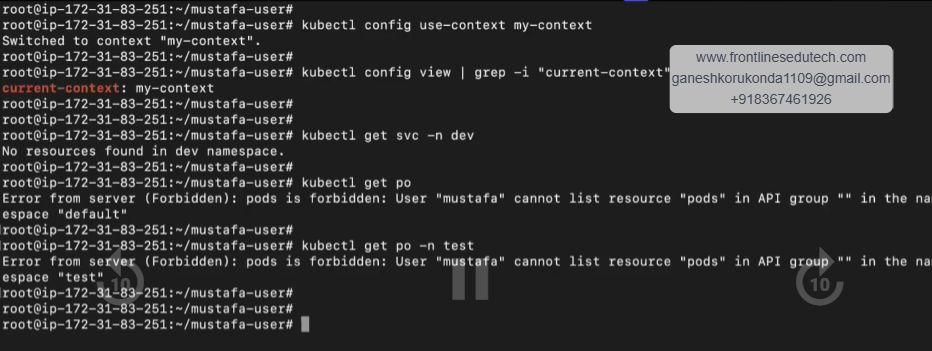

Now for cluster role :
Now copy role to cluster role -> cp role.yml 
cluster-role.yml
vim clusterrole.yml __>
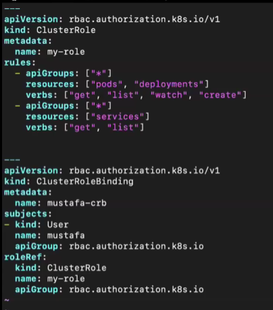
now create --> kubectl create -f cluster-role.yml
Change to minukube to perform --> kubectl config use-contect minikube
create--> kubectl create -f cluster-role.yml
see pod --> kubectl get po
wwe can do everything we have permsion for enteir cluster

