K8'S VOLUME AND LIVENESS PROBES:

Basically these K8's will works on short living data.So lets unveil the power of volumes like EmptyDir, HostPath, PV & PVC.

The data is a very important thing for an application. In K8's, data is kept for a short time in the applications in the pods/containers. By default the data will no longer available. To overcome this we will use Kubernetes Volumes.

But before going into the types of Volumes. Let's understand some facts about pods and containers' short live data.

-->The volumes reside inside the Pod which stores the data of all containers in that pod.

1. EmptyDir
We use hostPath to replacte data from one container to other container --> if we add or delete 

The volumes reside inside the Pod which stores the data of an contamers in that pod.
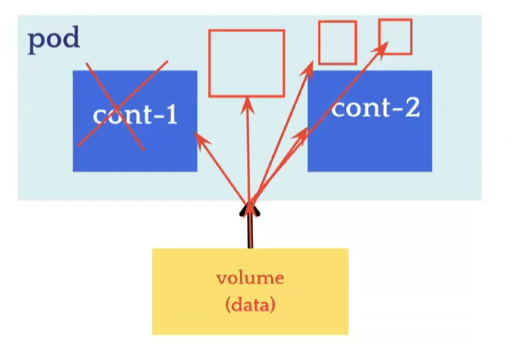

Write deployment file -->deployment.yml
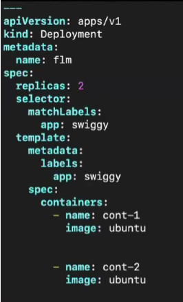

error will come if you create mulitple containers we need to perfprm some commands -->
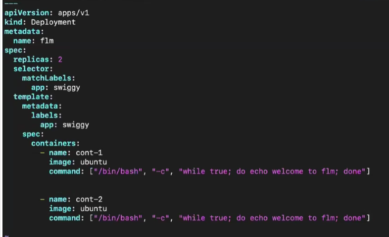
need to delete old deplotment --> kubectl delete deploy flm
create ---> kubectl create -f deploymet.yml
see pods --> kubectl get po

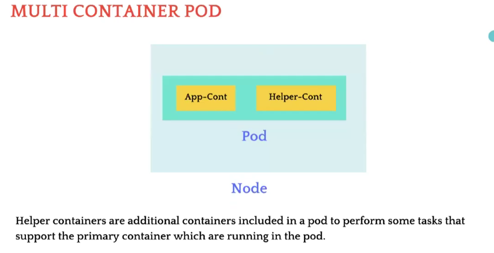

How Helper container works:
. A helper container is used to collect the logs from the primary container.
· Helper containers can be used to run monitoring and metrics collection agents from the main application container.
· Helper containers can assist in syncing files or data between containers in a pod. For example, a pod might have a main application container and a helper container responsible for syncing configuration files or other shared resources.
· Security-related tasks, such as handling secrets, encryption, or authentication, can be done by helper container.

We just created containers now we need to attch the volume to the containers-->
ADD script in deployment.yml
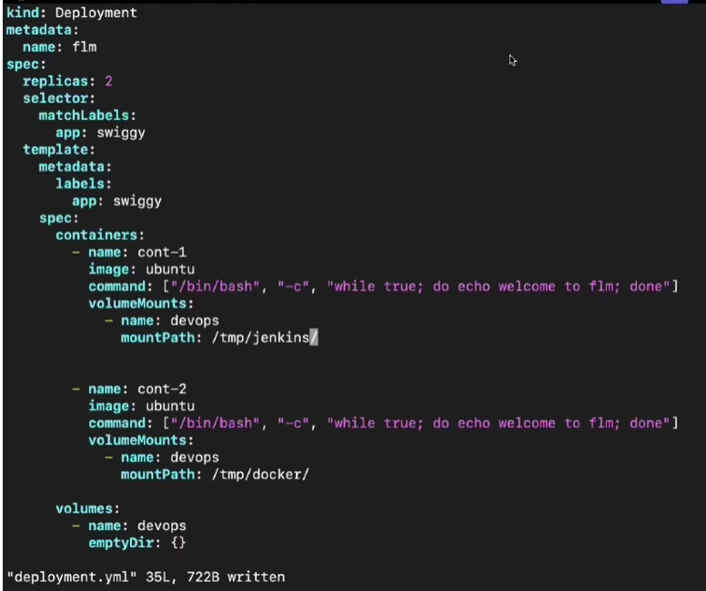

 deploy create-->
what we done --> 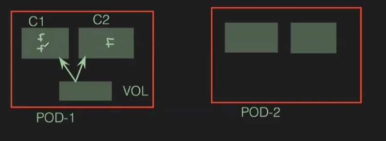

Take any pod and got into it -->
kubectl get po 
kubectl exec -it flm-xxxxxxxxx -c cont-1 --bash 
cd tmp/jenkins/
Now need to create files --> touch gitlab github-actions travis 
exit
CRTL+D
now goto cont2 --> see if they are in cont2 file 
kubectl exec -it flm-xxxxxxxxx -c cont-2 --bash 
cd tmp/docker/
see files are there or not 
touch file1 files2 ...
goto cont1 and see the replication

Now we need to see in POD in above there is in containers but not in pod 
there is no replicaiton for pods by default 

DrawBack :  
If the Pod gets deleted, then the volume will also get deleted which leads to a loss of data for all containers permanently.So we wont use this in production 

2. Host-Path:
· This volume type is the advanced version of the previous volume type EmptyDir.
· In EmptyDir, the data is stored in the volumes that reside inside the Pods only where the host machine doesn't have the data of the pods and containers.
· hostpath volume type helps to access the data of the pods or container volumes from the host machine.
· hostpath replicates the data of the volumes on the host machine and if you make the changes from the host machine then the changes will be reflected to the pods  volumes(if attached).

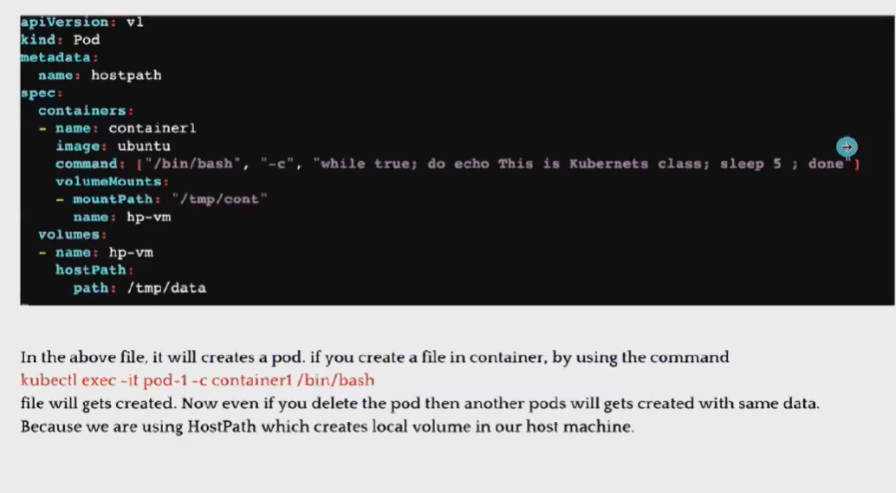
If the pod got delete the data will be done so now we arent attaching volume to the pod. we are attaching to host means to server.
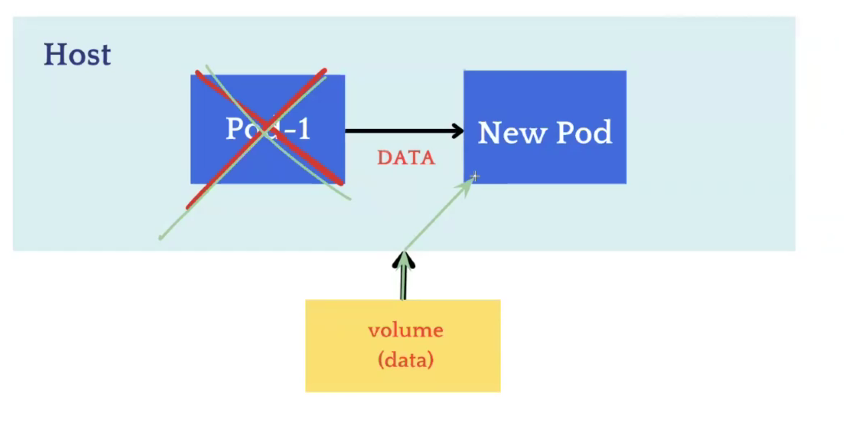
For deployment file just neeed to change volumes hostpath --> 
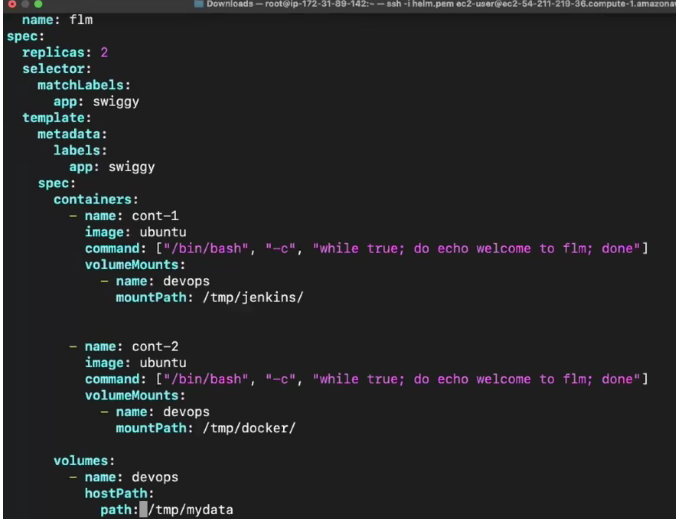
now create --> kubectl create -f deployment.yml

Now container to container and Pod to Pod replication is also taking place.
See in real time
See pods --> kubectl get po
goto pod1 --> kubectl exec cont -it flm-xxxxx -c cont-1 -- bash
goto dir --> cd tmp/jenkins
create files --> touch devops aws devops 
Now go and see in cont2 if replica happens 
goto cont2 --> kubectl exec cont -it flm-xxxxx -c cont-2 -- bash
goto --> cd tmp/docker/
see we can have files we have checked for container replica now we need to see for pod replica 
We wont have replica in pods 
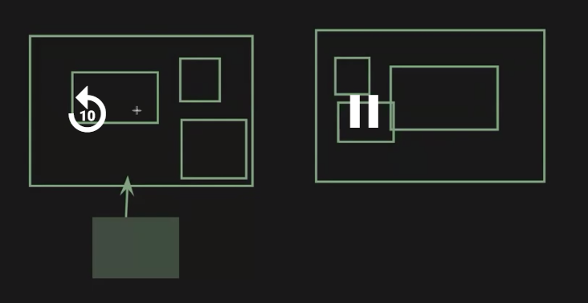
if we see it was attached to one worker node 

Now scale up increse replicas as 4 :
apply --> kubectl apply -f deployment.yml
get --> kubectl get po
check newly created pods -->for both then 1 will have data other dont have data due to replication didnt happen 
So we cant use this in real time or in production 
we can use if we single node cluser

3. PV & PVC:
To store data in cloud we use --> EBS 
Now we use one EBS volume and we attach to cluster
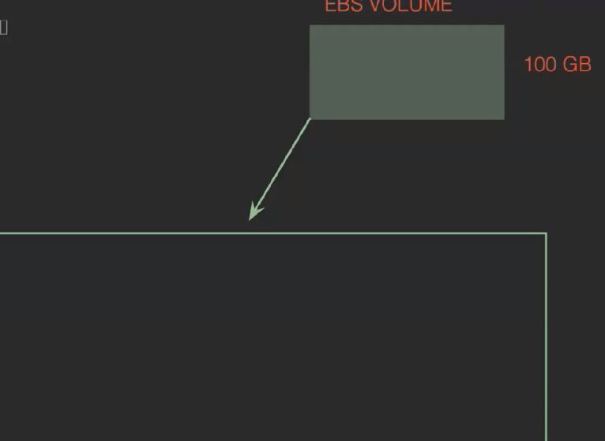

PV & PVC:
PERSISTENT VOLUME:
· Persistent means always available.
· Persistent Volume is an advanced version of EmptyDir and hostPath volume types.
· Persistent Volume does hot store the data over the local server. It stores the data on the cloud or some other place where the data is highly available.
· In previous volume types, if pods get deleted then the data will be deleted as well. But with the help of Persistent Volume, the data can be shared with other pods or other worker node's pods as well after the deletion of pods.
· PVs are independent of the pod lifecycle, which means they can exist even if no pod is using them.
· With the help of Persistent Volume, the data will be stored on a central location such as EBS, Azure Disks, etc.PERSISTENT VOLUME:

We use EBS to overcome above faults:
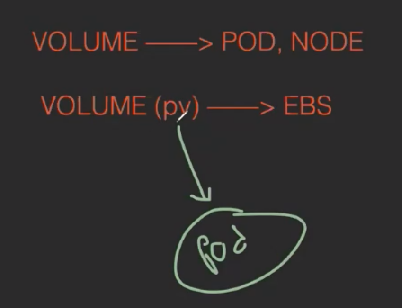

To implement:
create an EBS Volume
Take 10gb
name pv and pvc --> ccreate and volume id we need to copy
create pv --> vim pv.yml
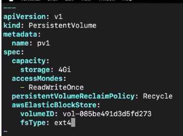 accessModes
kubectl create -f pv.yml
kubectl get pv
Create 2nd pv --> goto pv.yml and take 2gb and pv2 name
kubectl create -f pv.yml 

Now create pvc --> pvc.yml
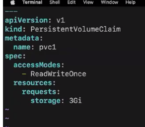
kubectl create -f pvc.yml
kubectl get pvc
It will be in pending because it is not attached to any pod 

Goto deployment file -->deployment.yml
changes in volumes
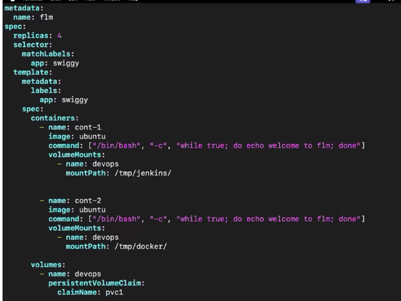
delete previous deployment --> kubectl delete deploy flm
and replicas also make it 2
create --> kubectl create -f deployment.yml
get po--> kubectl get po -w
kubectl get pvc
we can have claimid
Kubectl get pv

Now we need to check for pod repliaction
we will have data replication for pods 

We finally use PV & PVC for real time during  Production

