HELM:
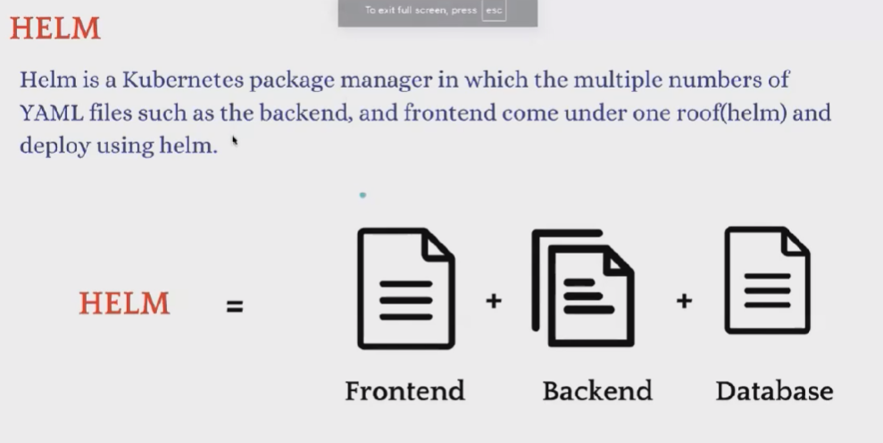

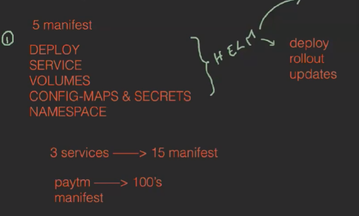

By using Helm we can orgainze in structured manner:
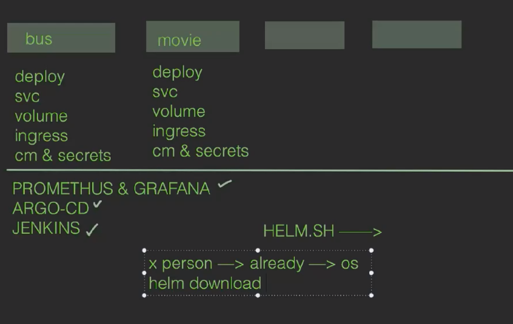

HELM.SH --> Process
docker -> image -> deploy -> helm-> os

We need to setup KOPS 
Need to install helm in cluster
paste the 3 cmds
Check version --> helm version
Now we will have pre defined deployment files

create --> helm create devops
ll
goto folder --> cd devops
ll
open --> vim charts.yml
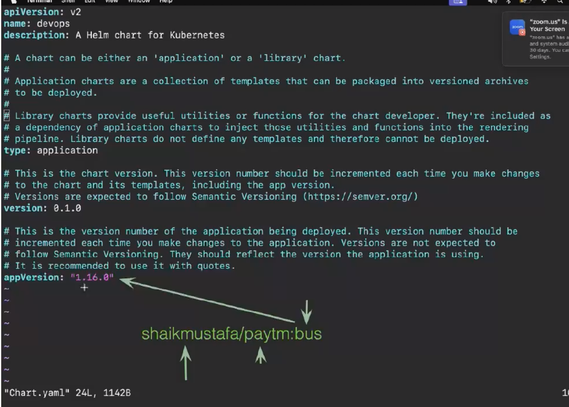
goto templates --> cd templates (we have all the files demos)
open deployment.yml --> vim deployment.yaml
image need to change
Make required changes 
helm install version-1 .
To get app URL : echo http://$SERVICE_IP:80 or kubectl get svc
see deploy --> kubectl get deploy
pods --> kubectl get po

Now we need to update an image --> vim values.yaml
goto image part 
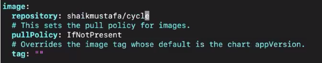
for tag: vim Chart.yml
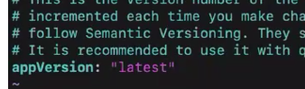
Upgrade --> helm upgrade version-1 .
Check revsion 2 will come now reload the page we can see the app load 

Again update the image -> 
change image in values.yml
update --> heml upgrade version-1 .
reload the page the app should run 

To see history of upgrades --> helm history version-1 
To rollback to a previous version --> helm rollback version-1
To rollback to a specific version --> helm rollback version-1 1 
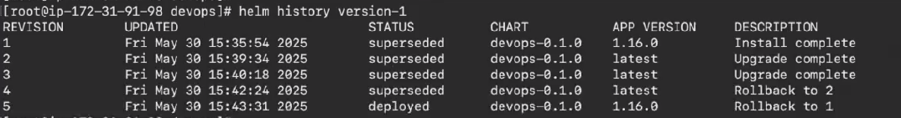

see the list --> helm list
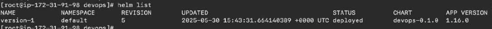

To unistall --> helm uninstall version-1 
Now all the pods deployments replicasets will be deleted

Now delete the devops --> rm -rf devops/

Now we create new helm
create --> helm create phani
goto -> cd phani/
If we didnt understand the manifest files we can delete the all and can keeep our own manifest files
rm -rf *
create --> vim deployment.yml
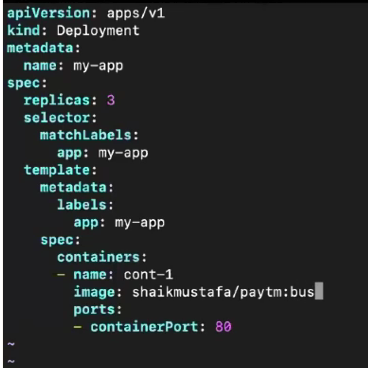
vim service.yml
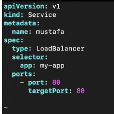
now install --> helm install flm .
see deploy --> kubectl get deploy
svc --> kubectl get svc
list --> helm list 
Now try to access app in browser

To see our own template --> helm template .

To check syntax errors in files --> helm install aws --debug --dry-run .
It will see the syntax error and show us 

To uninstall --> helm uninstall flm

Now how to setup applications like Argocd or jenkins 
1. Jenkins setup:
goto helm.sh --> charts 
search jenkins -->> 
cmds cp & py
We download repository of jenkins
To see the list of repos --> helm repo list
Better to update the helm charts  --> helm repo update
install --> helm install jenkins jenkins/jenkins 
Follow the commands... for password 

we cant use clusterIP to access using browser 
To access we need to use nodebalancer so we need to expose 
kubectl get svc
kubectl get po 
kubectl get po --show-labels
we need to give our own label --> kubectl label pod jenkins-0 cicd=jenkins
show --> kubectl get po --show-labels | grep "cicd"
Now create a service --> service.yml
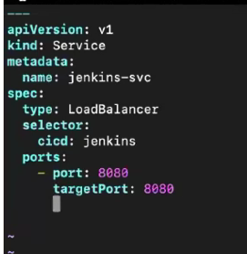
create --> kubectl create -f service.yml
svc --> kubectl get svc
Now copy dns name and paste in browser it will take time and :8080
Login to jenkins 

2. For our own application create helm chart so that other devloper can use helm charts
create --> helm create myapp
goto myapp --> cd myapp
goto templates --> cd templates
delete templates --> rm -rf *
vim deployment.yml , vim. service.yml
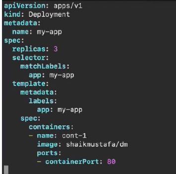
service.yml 
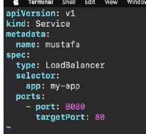 port is 80
goto my app cd .. ..

To test in local
test --> helm install test .
servie -->kubectl get svc
copy dns and check in local browser
can delete now its working --> helm uninstall test

Test in other 
we need to test the app -->helm lint . 
we can do --> helm template .  

Noimp
debug --> helm install aws --debug --dry-run .

Done with testing now need to pack
pack --> need to go back means plain and if ll then myapp should come 
pack -->helm package myapp
we have tar.gz file 
helm repo index . --> now a index file will be create in that all the details will be there regarding the helm details
install git --> yum install git -y
now need to commit some files index and tar.gz file-->mkdir mygit
mv index.yml mmyapp-0.1.0.tgz mygit 
cd mygit 
now we need to commit and send to git 
git init 
git add *
git commit -m "helm files are ready" .
Now we need to create a github repo --> myfirsthelm
copy url
git remote add origin url
git push -u origin master
Now we can regenrate token with developer settings and paste 
goto repo--> settings --> pages --> source deploy from branch--> branch master /root --> save
URL will be generated if we wait for sometime

If we clone and push then its working 
If we connect repo its not working

To download repo --> 
helm repo add myapp url
helm repo list
helm repo update
helm install musfta myoldapp/musfata (1st mustafa can be anything my oldapp should be name repository is downloaded and  3rd musfata should in index file name)
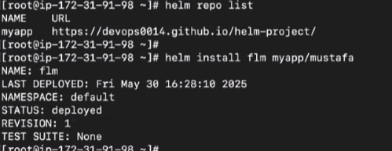
kubectl get deploy
kubectl get po
kubectl get svc

IMP: To delete
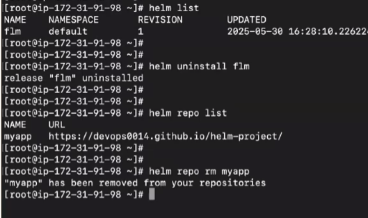
 

