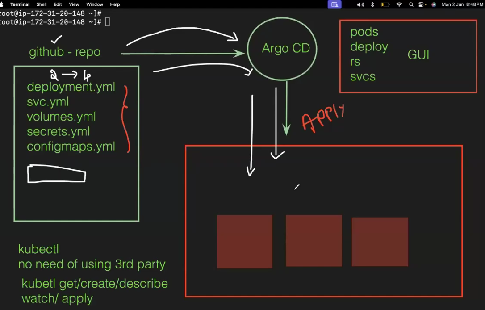
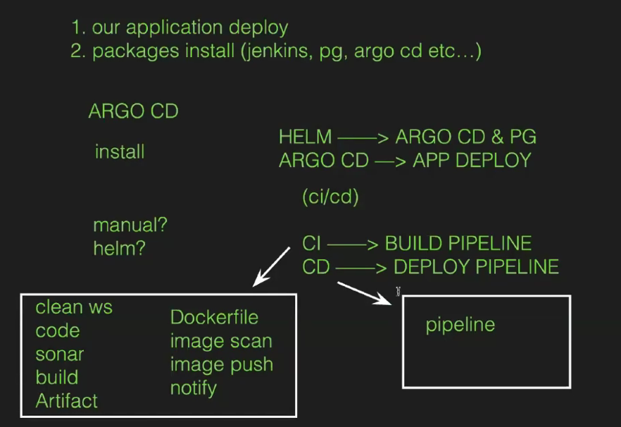
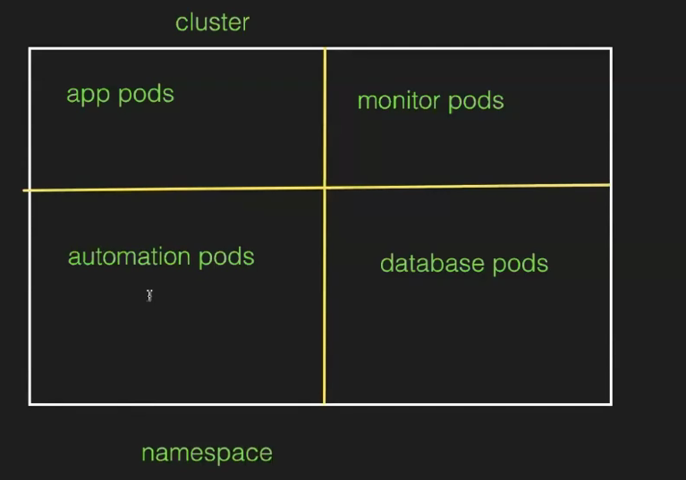
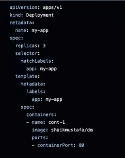
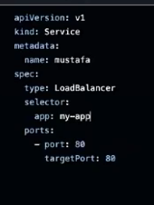

Launch KOPS cluster
kops create cluster -name mustafa.k8s.local -- zones us-east-1a, us-east-1b -master-count=1
-master-size t2.large -- master-volume-size 30 -node-count=3 -node-size t2.medium -- node-volume-size 20

ARGOCD:
Pipeline 2 types 
1. Build Pipeline
2. Deployment Pipeline --> this we intergrate with argocd

It is a GITOPS tool
GitOps is a way of managing software infrastructure and deployments using. Git as the source of truth.

Git as the Source of Truth: In GitOps, all our configurations like (deployments, services, secrets etc .. ) are stored in git repository.

Automated Processes: Whenever we make any changes in those YAML files gitops tools like (Argo CD/ Flux) will detects and apply those changes on kubernetes cluster. It ensures that the live infrastructure matches the configurations in the Git repository.

Here, we can clearly observe that continuous deployment. Whenever we make any changes in git, it will automatically reflects in kubernetes cluster.

CD --> dockerhub image will be taken and write manifest file and put it in github and integrate with ArgoCD.

We will deploy with ArgoCD

WITHOUT ARGO CD:
Before ARGO CD, we deployed applications manually by installing some third party tools like kubectl, helm etc ...

If we are working with KOPS, we need to provide our configuration details (RBAC) or If we are working on EKS, we need to provide our IAM credentials.

If we deploy any application, there is no GUI to see the status of the deployment.

so we are facing some security challenges and need to install some third party tools.

Now we need to install helm 
copy paste 3 cmds 

To isolate all the argocd with namespace
kubectl create namespace argocd
kubectl apply -n argocd -f https://raw.githubusercontent.com/argoproj/argo-cd/stable/manifes
ts/install.yaml
kubectl get all -n argocd

EXPOSE ARGOCD SERVER:
kubectl patch syc argocd-server -n argocd -p '{"spec": {"type": "LoadBalancer"}}'
yum install jg -y
export ARGOCD_SERVER='kubectl get svc argocd-server -n argocd -o json | jq -raw-output '.status. loadBalancer. ingress[0].hostname''
echo $ARGOCD_SERVER
kubectl get syc argocd-server -n argocd -o json | jq -- raw-output .status. loadBalancer. ingress[0].hostname
The above command will provide load balancer URL to access ARGO CD
Now copy the dns and paste in browser
User --> admin
password --> 

TO GET ARGO CD PASSWORD:
export ARGO_PWD='kubectl -n argocd get secret argocd-initial-admin-secret -o jsonpath="{.data.password}" | base64 -d'
echo $ARGO_PWD
kubectl -n argocd get secret argocd-initial-admin-secret -o jsonpath="{.data.password}" | base64 -d
The above command to provide password to access argo cd
copy the password and paste --> login

Now we need to create a application and intergate github with it 
So we will create repo in  github
Name -->argocd 
create file --> deployment.yml

Service.yml

Now we need to integrate the github with argocd 
Copy the repo url
In argocd --> new app 
Name --> demoapp
ProjectName --> default
Sync policy --> Automatic 
Repo url --> paste
Revision --> main
path --> ./ (The files are in main dir so )
Des CLuster url --> deafault
Des namespace --> deafult 
Now create --> See status 

Goto cmd -->
kubectl get po 
kubectl get svc 
kubectl get rs 

You can see the whole flow in GUI from argocd

Need to access application --> we need dns 
Dns will be in service --> open service
We will have hostnames --> it is dns and copy in browser we can access application

If we goto deployment.yml file and change the pod replicas --> increse from 3 to 5 and commit 
Refresh the GUI then POds will be created.

We can observe the creation of pods when old one gets deleted clearly -->
goto deployment.yml and change image name --> dm to cycle and commit 
Refresh we can obesrve new and then old one gets deleted.

We can have history and rollback also
We can rollback to required one as our wish 

We can check logs of the pods also 

Now for Commit  Manual Process :
We will have diff option we can see the changes from previous to original means if we change replicas then it will give you the pattern

We need to sync everything manually

To give access for other user 
Settings --> 

