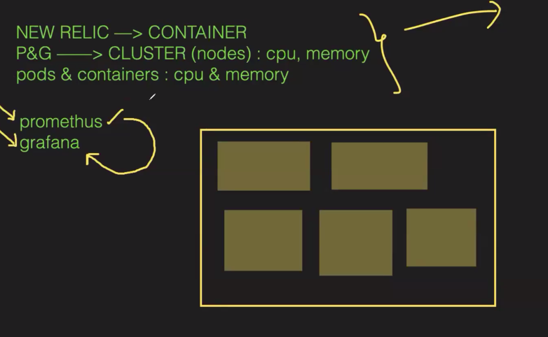
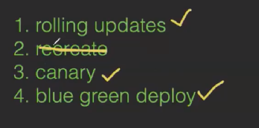

Prometheus, Grafana & Deployment Strategies:

To monitor usage we use monitoring tools:

We need to isolate both the P & G with ns
and P is monitoring tool it have raw data to see raw data we use G to get good GUI.

Create KOPS cluster:
Install helm --> 3 cmds
nodes --> kubectl get no

INSTALL K8S METRICS SERVER:
-->kubectl apply -f https://github.com/kubernetes-sigs/metrics-server/releases/latest/download/components.yaml

goto helm charts website and search for prometheus & Grafana
helm repo add prometheus-community https://prometheus-community.github.io/helm-charts

helm repo add grafana https://grafana.github.io/helm-charts

check list --> helm repo ls 
Update --> helm repo update

Now we need 2 ns for both P & G -->
ns for P --> kubectl create ns prometheus
Now install P in ns --> helm install prometheus prometheus-community/prometheus --namespace prometheus --set alertmanager.persistentVolume.storageClass="gp2" --set server.persistentVolume.storageClass="gp2"
get pods --> kubectl get pods -n prometheus
get all-->  kubectl get all -n prometheus

ns for G --> kubectl create ns grafana
install G in ns --> helm install grafana grafana/grafana --namespace grafana --set persistence.storageClassName="gp2" --set persistence.enabled=true --set adminPassword='EKS!sAWSome' --set  service.type=LoadBalancer

For userName = admin password = run cmd
To accesss dashboard we need to expose the pods --> give 2nd cmd to expose  both cmds
services --> kubectl get pods -n grafana
using dns name we can access the app and login
all svc --> kubectl get service -n grafana

We need to update the security groups of the load balancer. or else you cant access application

Now login
In Connections --> Data source --> Prometheus
We need to give  http://prometheus-server.prometheus.svc.cluster.local/
save and test

Import Grafana dashboard from Grafana Labs
grafana dashboard → new → Import → 6417 → load → select prometheus → import
It will show the no of containers, pods deployments

we can also import other port -->1860 select prometheus → import 
It will show the clsuter monitoring like system load ,ebs volume , ram and rom 
ADD 1860 PORT TO MONITOR NODES INDIVIDUALLY

ADD 315 PORT TO MONITOR THE FOLLOWING TERMS:
 Network I/O pressure.
 Cluster CPU usage.
 Cluster Memory usage.
 Cluster filesystem usage.
 Pods CPU usage.

NOW DEPLOY ANY APPLICATION AND SEE THE RESULT IN DASHBOARD.

Try to create pod and see the changes in dashboard -->kubectl run pod-1 --image=nginx

We can also filter with ns
We can also set alerts in grafana --> create contact point all details 

 ---------------------------------------------------------
Interview Questions Main : Deployment strategies
which Deployment strategies you are using in your project?

Major problems during deployment--> 
Better check the PDF for ref

4 types :

WHAT IS DEPLOYMENT STRATEGY
 These are the techniques which are used to manage the rollout and scaling of applications within a Kubernetes cluster

Verify that the metrics-server deployment is running the desired number of pods 
-->kubectl get pods -n kube-system
-->kubectl get deployment metrics-server -n kube-system

