Interview Questions in this Vedio

-------------------------------------------------------
PROBES:
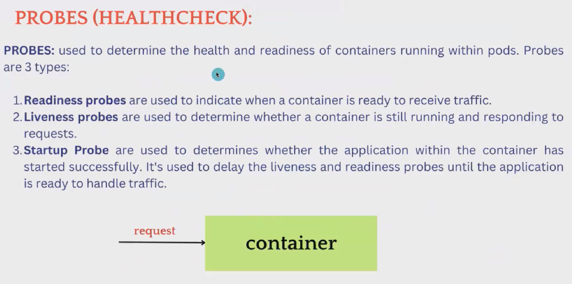
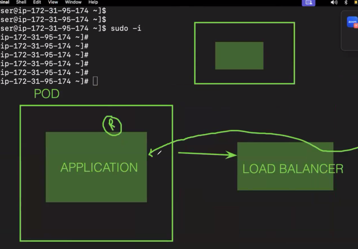

Live Explain:
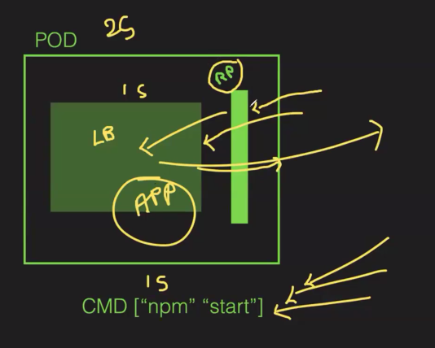

We can use MiniKube
mkdir phani
cd phani
create -->vim pod.yml
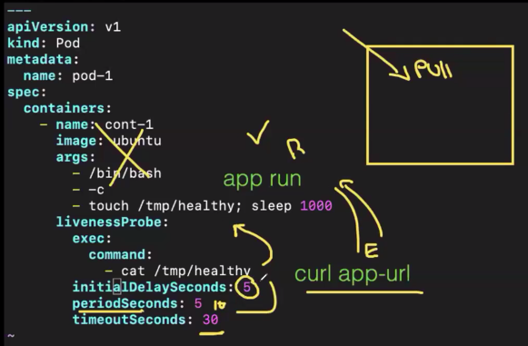
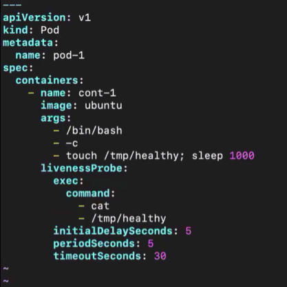 --> use this
start --> systemctl start docker
start --> minikube start --driver=docker --force
create pd --> kubectl create -f pod.yml
get po --> kubectl get po
describe --> kubectl describe pod pod-1
go into pod -->kubectl exec -it pod-1 -- bash
give --> ll tmp/
check there should a file named healthy it will check for 5mins 
exit

If we delete the tmp healthy file and describe then the liveness probe will be failed 
It will wait for 30sec then it will create a new container.

CRON JOBS:

KUBERNETES JOBS:
It is a resource that is used to achieve a particular work like backup script and, once the work is completed the pod will be deleted.

Use cases:
· Database backup script needs to run
. Running batch processes
· Running the task on the scheduled interval
· Log Rotation

Key Features:
. One-time Execution: If you have a task that needs to be executed one time whether it's succeed or fail then the job will be finished.
. Parallelism: If you want to run multiple pods at the same time.
. Scheduling: If you want to schedule a specific number of pods after a specific time.
. Restart Policy: You can specify whether the Job should restart if fails.

In k8s if we create Jobs then it will automatically create pods.
create -->vim jobs.yml
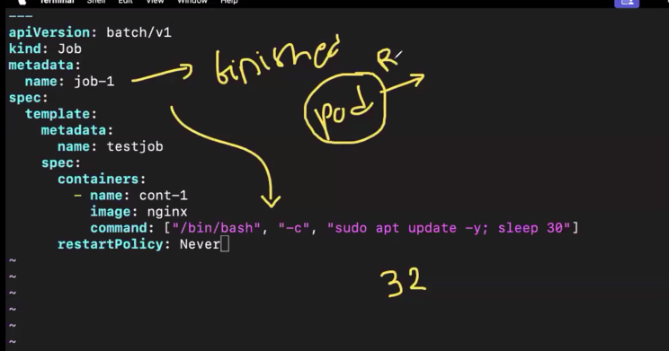
create --> kubectl create -f jobs.yml
get --> kubectl get jobs
get po --> kubectl get po
see seconds 

cronjobs:
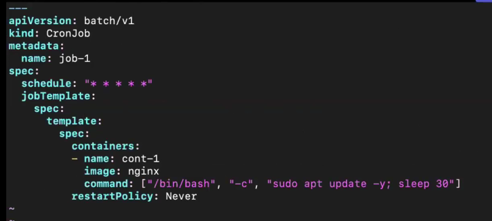
create --> kubectl create -f cronjobs.yml
get --> kubectl get cj
po --> kubectl get po 
see seconds for every 30 sec new pod will be created.
To get detail --> kubectl get po -w
To delete --> kubectl delete cj --all
jobs -> kubectl delete jobs --all

------------------------------------------------
Network polices:
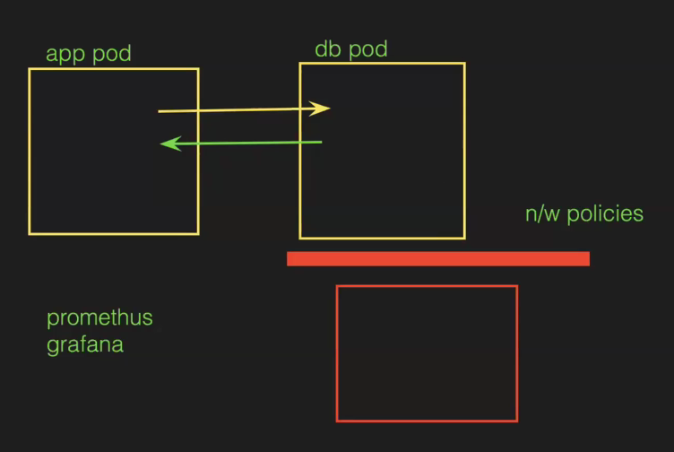 
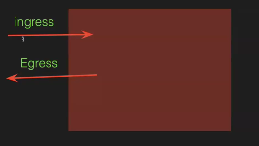

Delete all pods 
create --> pod.yml 
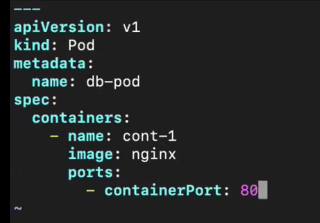
ns -->kubectl create ns dev 
create -->kubectl create -f pod.yml -n dev
see --> kubectl get po -n dev
copy -->cp pod.yml app-pod.yml
open --> app-pod.yml
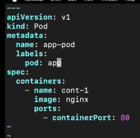
create --> kubectl -f app-pod.yml -n dev
get --> kubectl get po -n dev --show-labels
1 have label other dont have give for other --> kubectl label pod db-pod -n dev pod=db
now check labels -->kubectl get po -n dev --show-labels

Now we can give app pod one small cmd: Condition we need ip so 
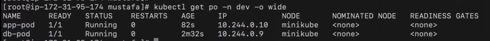
vim app-pod -->
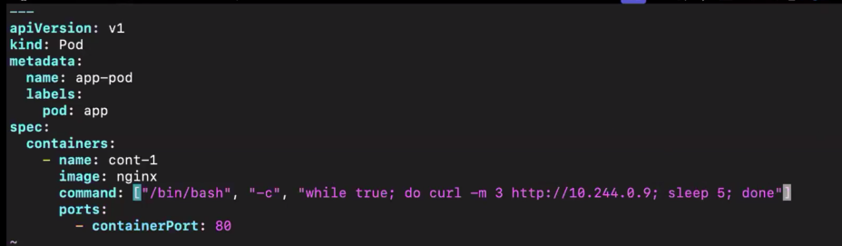
Now apply --> kubectl apply -f app-pod.yml dev
it wont work need to delete old pod and create new 

delete -->kubectl delete pod app-pod -n dev
apply -->kubectl apply -f app-pod.yml dev
Now check logs --> kubectl logs app-pod

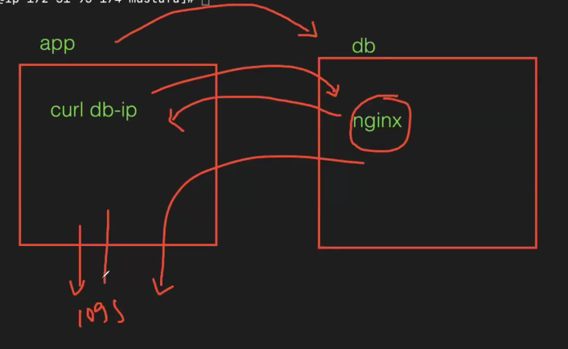

1hr.09min
wwe need to stop N/W communication

