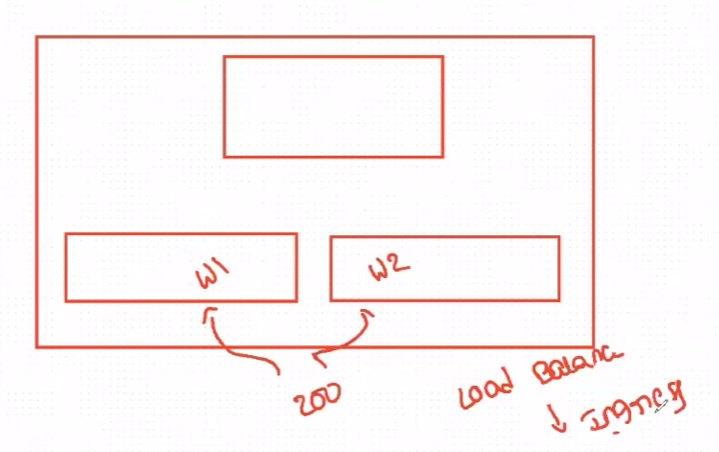
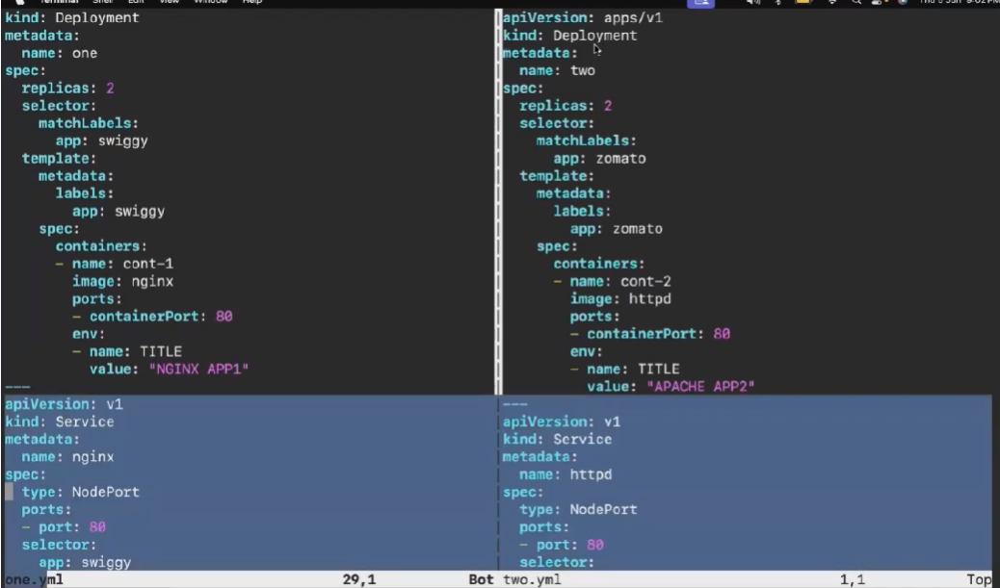
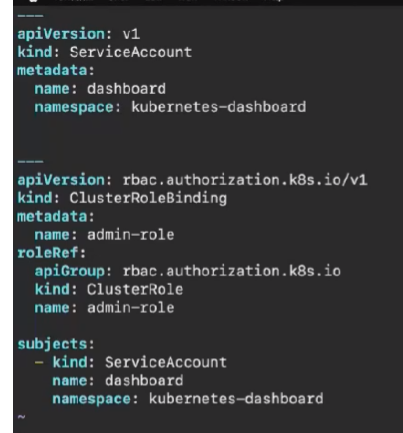
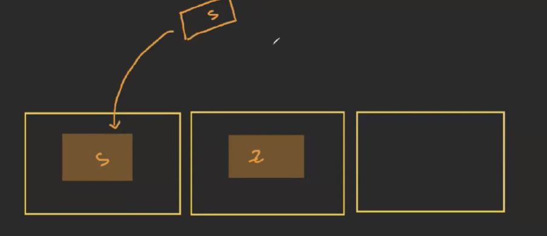
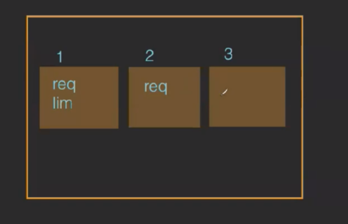
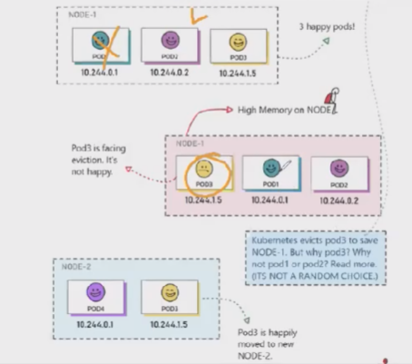

Ingress, K8S Dashboard, PodAffinity & AntiAffinity, QOS:

We have KOPS installing in this 
Ingress:
Adv for load balancer

--> Ingress helps to expose the HTTP and HTTPS routes from outside of the cluster.
-->Ingress supports 
1. Path-based 
2. Host-based routing
--> Ingress supports Load balancing and SSL termination.
--> It redirects the incoming requests to the right services based on the Web URL or path in 
the address.
--> Ingress provides the encryption feature and helps to balance the load of the applications.

cluster 
Install ingress in K8s  --> cmds 
clone repo of ingress --> git clone url
ll
open both files --> vim -O one.yml two.yml
](image-1.png)
open ingress file --> vim ingress file
apply --> kubect apply -f .
Now 3 resources will be created
see ing -->kubectl get ing
svc --> kubectl get svc
Now dns will come if we give get ing
Now copy and paste in browser 
If we give /httpd then htppd will come 
by default it will give nginx

---------------------------------------------------
K8S Dashboard 
we can see in offical dashboard  check some cmds 
we can setup using helm
Install helm --> see cmds and run
now helm repo add --> helm repo add 
kubernets-dashboard httpd://kubernerts.github.io/dashboard 
upadte --> helm repo update
helm upgrade -install kubernetes-dashboard -->kubernetes-dashboard/kubernetes-dashboard -create-namespace -- namespace kubernetes-dashboard

check -->kubectl get po -n kubernetes-dashboard
check svc -->kubectl get svc -n kubernetes-dashboard

To access services from clusterIp we cant access from internet to access we need to do portforwarding
kubectl port-forward -n kubernetes-dashboard svc/kubernetes-dashboard-kong-proxy 1111:443 --addrees=0.0.0.0 &

We can access using KOPS server PublicIp with portno :1111
formart--> https:PBIP:1111
Procedd then you can access 
We need to generate the token We need to create service account and generate a token.
create -->vim access.yml

apply --> kubectl apply -f access.yml
now we need to create token--> kubectl create token dashboard -n kubernetes-dashboard
Using token we can login to dashboard

We cant access anything because we havent given any role we create a rolebinding in acceess.yml 

If we resolve the issue we can access all the info 

Check things and see all the deatils 
Better to use ArgoCd that this K8s dashboard

--------------------------------------------------
POD Affinity and Anti Affintiy:

To create new pod in same pod 

Other than specific pod it can create anywhere

------------------------------------------------
QOS:Quality of service:

Based on quality of 3 types.

