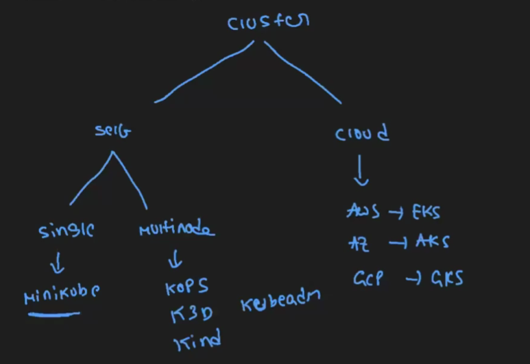
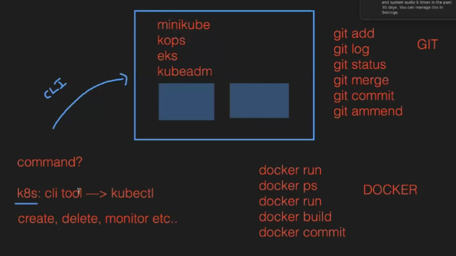
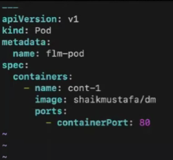

MiniKube: Its a tool used to setup a single node cluster on K8's
It is a tool used to setup single node cluster on K8's.
It contains API Servers, ETCD database and container runtime
It helps you to containerized applications.
It is used for development, testing, and experimentation purposes on local.
Here Master and worker runs on same machine
It is a platform Independent.
By default it will create one node only.
Installing Minikube is simple compared to other tools.

Install MiniKube:
Launch Instance --> 
EBS vol 20,  T2.meduim,  Ubuntu
Connect.........
TO install anything in ubuntu we need to update it first ---> apt update -y

Goto root user ---> sudo -i
update --> apt update -y
Install Docker --> apt install docker.io -y
Check status --> systemctl status docker 
Goto page to install MiniKube -->https://minikube.sigs.k8s.io/docs/start/?arch=%2Fwindows%2Fx86-64%2Fstable%2F.exe+download
Run 2 cmds 
Check minikube version --> minikube version
To start minikube --> minikube start --driver=docker --force
Status --> minikube status
Now we have kube cluster --> it is used to create PODS

To create PODS: k8s cli tool ---> Kubectl

Install kubectl ---> https://kubernetes.io/docs/tasks/tools/install-kubectl-linux/
Run cmd and it will install kubectl
ll and we see kubectl file to install we need to give X permissions ---> chmod +x kubectl
This should be moved to the default path --> mv kubectl /usr/local/bin/
Check version --> kubectl version

What is POD?
IN POD there are so many containers --> In real time 1 POD 1 or 2 containers based on req
It is a smallest object that we can create in K8's.
· It is a group of containers.
· Pod acts like a single instance for our application.
· Pods are ephemeral (short living objects)
· Mostly we can use single container inside a pod but if we required, we can create multiple containers inside a same pod.
. when we create a pod, containers inside pods can share the same network namespace, and can share the same storage volumes .
· While creating pod, we must specify the image, along with any necessary configuration and resource limits.
· K8's cannot communicate with containers, they can communicate with only pods.
· We can create this pod in two ways,
1. Imperative(command)
2. Declarative (Manifest file)

Creation of POD:
1. By Imperative(command)
create --> kubectl run mypod --image=nginx
list of pods --> kubectl get pods/pod/po

2. By Declarative 
check api-resources and their apiversions
create a file --> vim demo.yml

create a pod --> kubectl create -f demo.yml
list of pods --> kubectl get pods

