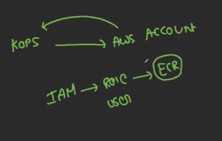
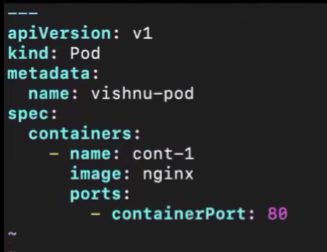
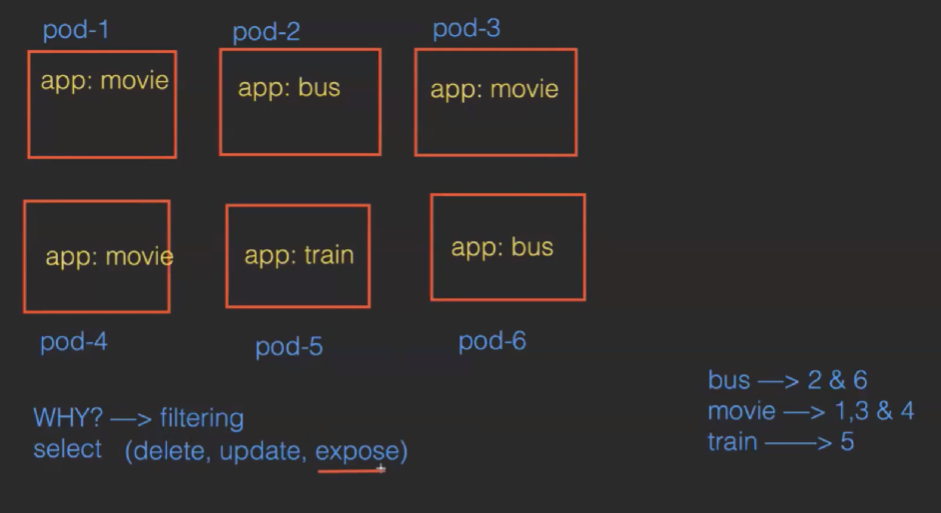
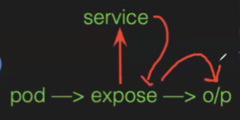
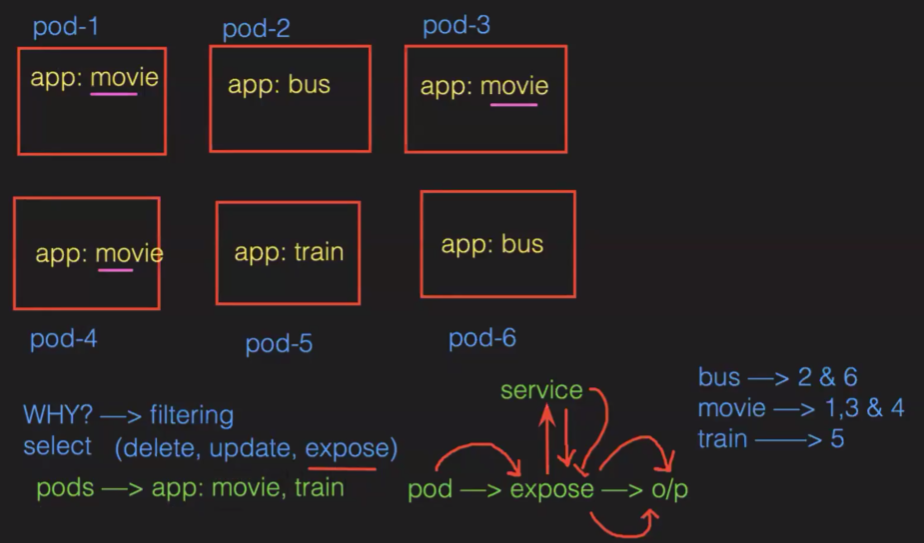
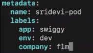
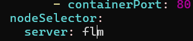

KOPS Kubernetes Operations --> https://kops.sigs.k8s.io/
kops will not only help you create, destroy, upgrade and maintain production-grade, highly available, Kubernetes cluster, but it will also provision the necessary cloud infrastructure.

T2.micro
KOPS install
Kubectl install
Aws cli
Cluster --> servers, asg,lb,sec-groups,vpc

Launch instance acc to reqd
sudo -i
vim .bashrc --> export PATH=$PATH:/usr/local/bin/
source .bashrc

Install Aws cli --> https://docs.aws.amazon.com/cli/latest/userguide/getting-started-install.html
curl "https://awscli.amazonaws.com/awscli-exe-linux-x86_64.zip" -o "awscliv2.zip"
unzip awscliv2.zip
sudo ./aws/install
aws --version

Install Kops --> https://kops.sigs.k8s.io/getting_started/install/
curl -Lo kops https://github.com/kubernetes/kops/releases/download/$(curl -s https://api.github.com/repos/kubernetes/kops/releases/latest | grep tag_name | cut -d '"' -f 4)/kops-linux-amd64
chmod +x kops
sudo mv kops /usr/local/bin/kops
kops version

Install kubectl -->https://kubernetes.io/docs/tasks/tools/install-kubectl-linux/
   curl -LO "https://dl.k8s.io/release/$(curl -L -s https://dl.k8s.io/release/stable.txt)/bin/linux/amd64/kubectl"
chmod +x kubectl
mv kubectl /usr/local/bin/
kubectl version

Now we need to attach role to create the services:

Now we need to create a cluster --> means groups of servers it will be created on cloud (AWS)
To create a bucket--> aws s3 mb s3://phani123.flm.k8s
To get buckets ---> aws s3 ls
We need to enable versioning manually (we can get back the deleted files its is used as a backup for files ) --> In Properties
We need to specify the bucket in which data need to save --> export KOPS_STATE_STORE=s3://phani123.flm.k8s
create cluster (extension is reqd)--> kops create cluster --name phani.k8s.local --zones us-east-1a, us-east-1b --master-size t2.medium --master-count 1 --master-volume-size 30 --node-size t2.micro --node-count 2 --node-volume-size 20
COPY the suggestion cmds
COpy and paste the last cmd
to know cluster ready or not --> kubectl get nodes
To get live data --> kubectl get no -w

Now in declarative way:
create a file --> vim deploy.yml

to create pod --> kubectl create -f deploy.yml
To get pod --> kubectl get pod
To know where the pod is created --> kubectl get pod -o wide
Then copy the workernode and search in instances

Try all these cmds:
 To get all the pods: kubetctl get pods (or) kubectl get pod (or) kubectl get po
 To delete a pod: kubectl delete pod pod_name
 To get IP of a pod: kubectl get po pod_name -o wide
 To get IP of all pods: kubectl get po -o wide
 To get all details of a pod: kubectl describe pod podname
 To get all details of all pods: kubectl describe po
 To get the pod details in YAML format: kubectl get pod pod-1 -o yaml
 To get the pod details in JSON format: kubectl get pod pod-1 -o json
 To enter into a pod: kubectl exec -it pod_name -c cont_name bash
 To get the logging info of our pod: kubectl logs pod_name
 To get the logs of containers inside the pod: kubectl logs pod_name -c cont-name

Labels, Selectors, and Node Selectors:
why to give labels to PODS. 

Expose: If we need to get OP from the pod then we need to expose using service.

If we want to expose a POD we use label. 

Overall :

Selectors: Helps to select the label and we can perform operations (selecting the label) 
we need to give in  metadata section -->

To see the labels for the pod --> kubectl get pod --show-labels
To give the label for existing POD--> kubectl label pod phani-pod app=zomato

If we want pods of sepecific (swiggy) --> kubectl get po -l app=swiggy
Multiple filter --> kubectl get po -l 'env in (test,dev)'

Node selector:If we want to create a POD in specific container we use it.
To achive it we will create POD by giving this

and run the file then pod will be created.

To delete all the application:---> IMP
export KOPS_STATE_STORE=s3://phani123.flm.k8s
kops get cluster
kops delete cluster -- name phani.k8s. local -- yes