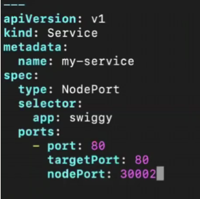

KUBERNETES Services:
To access the application running in a POD:
we cant direcly access so we need to expose and then acccess the app. For these there are services :
1. cluster Ip (For database pods)
2. Node port 
3. load balancer

Create instance and install KOPS 
until ready state
create a folder manifest --> mkdir manifest cd manifest
vim pod.yml

create --> kubectl create -f pod.yml
to know pods --> kubectl get pods

1. cluster Ip: used to access app internally
now we will create service so we need to write yml --> vim service.yml

create --> kubectl create -f service.yml
To know the services --> kubectl get svc (or) kubectl describe svc app-service
Now using the IP try to access application on online we cant but we can access from cluster --> curl IP

2. Node port : used to access app internal and external using nodeport
If we want to access app from online by using NODE PORT
It will provide stable IP and node pOrt
Nodeport range --> 30000-32767

create -->kubectl create -f service.yml
This we can acess via internal and external using port
using Publicip and portno given --> external
internal --> curl clusterip

3. load balancer:used to access app internal and external using nodeport or dns
If we obesrve we will access app throught 2 ips and we cant do it like that so we use node balancer to split reqest and remove traffic of response

Serive file -->

create service
kubecctl hget svc
we can access via link-->  ab607a1902e514b1caff1ee699f8a39e-665501766.us-east-1.elb.amazonaws.com
we can access via port no which randomly created

To delete any service --> kubectl delete svc lb-service
To get services --> kubectl get svc

