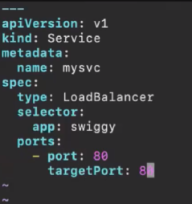

KOPS Script:

If a Pod or node got deleted then automatically another pod or node will be created due to replication.
Scaling --> Automation scaling 
2 types: In real time RS will be used
1. Replication Controller (V1) --> equality based selector(single label)
2. Replica Set (V2) --> set based selector (set of labels multiple)

Replication Controller:
Create yml file --> rc.yml
To know version --> kubectl api-resources | grep -i "rs"
Flow --> 

Senario: If 1 pod have swiggy and 1 pod has zomato and the swiggy pod got deleted the Rc will create the pod but how can it know which app to run ?. 
So for this when we create a rc it will have template 

If you see yml file the common thing is swiggy 

list of replication containers --> kubectl get rc
List of pods --> kubectl get pods 

Now we neeed to expose the pods so we will creaste service.yml

create service --> kubectl create -f service.yml
to know service created --> kubectl get svc

tO know rc --> kubectl get rc
Delete a pod to check it is creating pods or not --> kubectl delete pod pname
To know full info of rc --> kubectl describe rc myrc

Now we try to access app--> 
kubectl get service --> using this we have dns right

Now delete all pods --> kubectl delete pod --all
Still we can access application because of replication

We only have maual scaling in rc through manifest or cmd
By Manifest

Increse replica in file But in cmd we need to give apply --> kubectl apply -f rc.yml
kubectl get rc --> now we have 5 pods 

By Cmd:
kubectl scale rc myrc --replicas=4

Drawback: Auto scaling and Downtime
If we want to change the application and then apply the app wont change for that we need to remove the old rc and then create
kubectl delete rc myrc
kubectl get rc
then create new

REPLICA SET:
Copy the rc file as rs --> cp rc.yml rs.yml

create --> kubectl create -f rs.yml
get rs --> kubectl get rs
if we want to scale --> kubectl scale rs myrs --replicas 3

WE can try for multiple labels:
 Keep in I capital
kibectl apply -f rs.yml

Drawbacks:

Deployment:
 only changes the kind: Deployment in yml file 

create yml file

