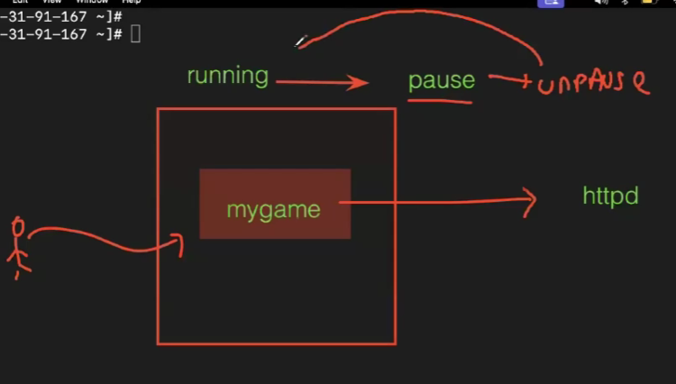
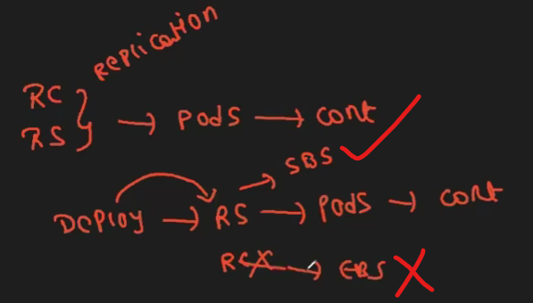
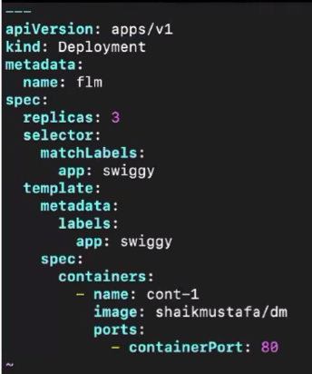
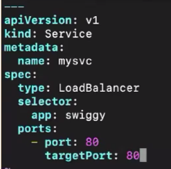
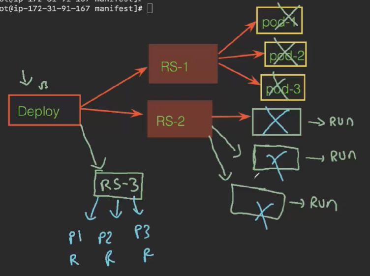
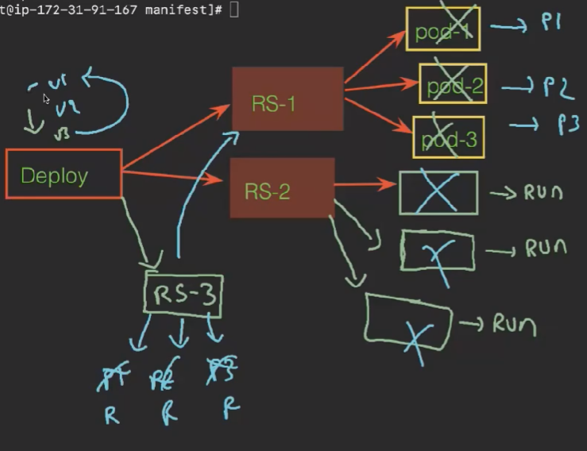
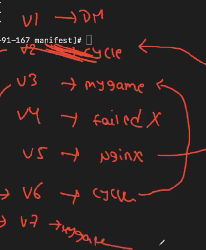
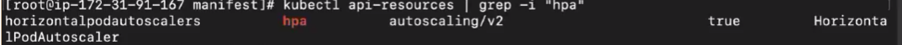
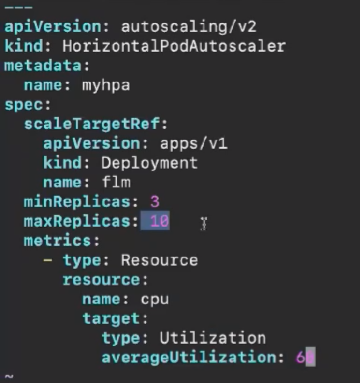
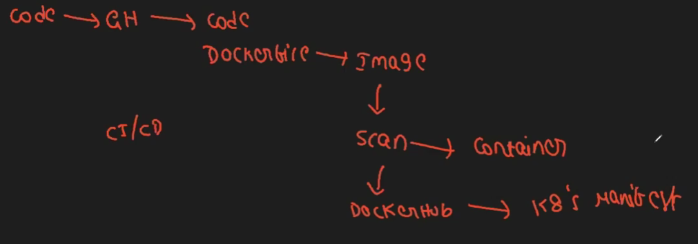

Components which provide replication are rs and rc 
The drawbacks in rs and rc are 
1. Downtime
2. No Autoscaling
3. No rollback

So we use Deployment feature to overcome these drawbacks
We can pause pod -->

We use this method:

Create folder and goto it 
create file --> 

kubectl create -f deployment.yml
To get deploys -->kubectl get deploy
If we create deploy then it will create rs 
check for rs --> kubectl get rs
rs will create pods 
check pods --> kubectl get pods
To know deploy info --> kubectl describe deploy dName

1. Checking downtime 
To check service we need expose 
create service file --> vim service.yml 
yml file --> 

kubectl create -f service.yml
kubectl get svc
--->Using the dns name we can acceess the application 
-->Now we can update the security groups of the workernodes keep All traffic of inbound and outbound rules
Now we need to create new change in applications 
now from manifest file change from cycle 
Now apply changes --> kubectl apply -f deploy.yml
Now see pods --> kubectl get pods 
To see which app is running in the pod --> kubectl describe pod pname

we can try with cmd also not by changing manifest file 
kubectl set image deploy dName cont-1=ImageName 
see pods --> kubectl get pods 
see --> kubectl describe podname 
Try for 2 or 3 app changes all those are  versions

2. Rollback:
kubectl rollout undo deploy flm --to-revision=2
kubectl rollout status deploy flm
FE: 
BE: 

To see history --> kubectl rollout history deploy flm

see how many rs --> kubectl get rs

we can see the live data by connect same server in aws and watch --> kubectl get rs -w

3.Scaling
kubectl scale deploy flm --replicas 1
from file --> change replicas no and apply 
1. Horizantal Pod Auto scaler 95%--> No oof pods increse
2. Vertical Pod Auto scaler --> Incresing size of pods making big

To achive them we need metric server
43.30mins take link and download
create file --> vim hpa.yml

apply --> kubectl create -f hpa.yml
check --> kubectl get hpa
check po --> kubectl get pods
take any pod go into it --> kubectl exec -it podname -- bash
apt update -y
apt install stress -y
stress -c 2 -t 300   
To stop --> exit

To monitor pods ---> connect in aws --> kubectl top pod -w

Process in real time -->

