Check pause clearly ---->

To deploy the databases in kubernetes ---> we use stateful Set
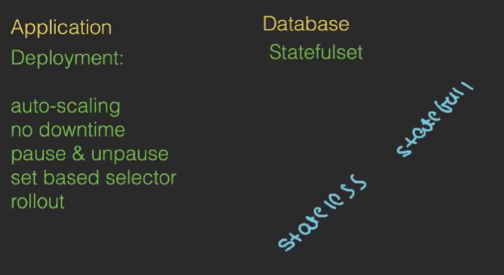

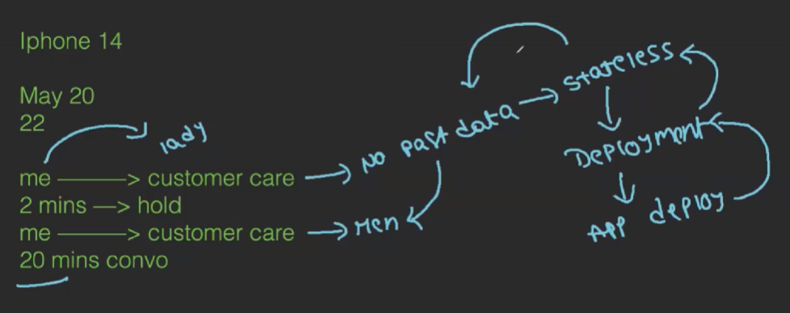

Senario:
If we have a cluster and it have 3 Worker nodes and its have pods 
If one pod got deleted and anyway it will create a replica but we cant know where the pod will be created but we dont have any prblm in application 
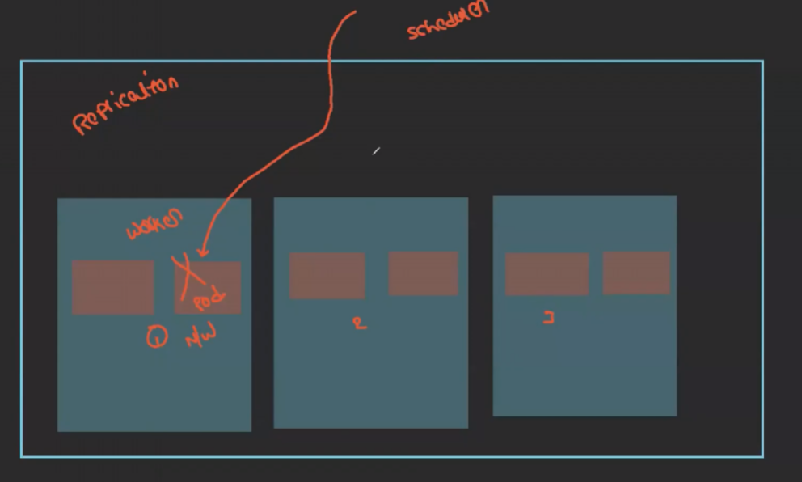
But if there is a database it should come at the same place where it is delete it should be created at Specific node and pod
PP--> primary pod we can insert and read 
SP --> secondary pod we can only read
In deployment pods will be randomly created and deleted
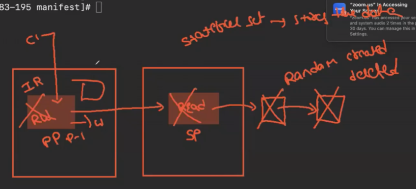

Diff b/n App and DataBase
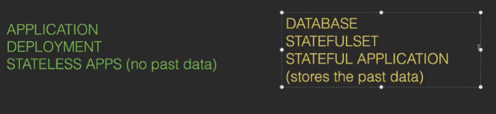
2nd point naming 
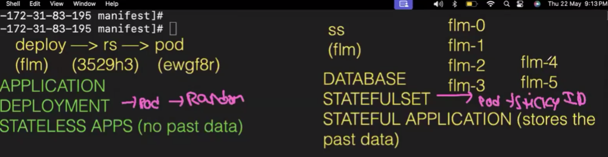

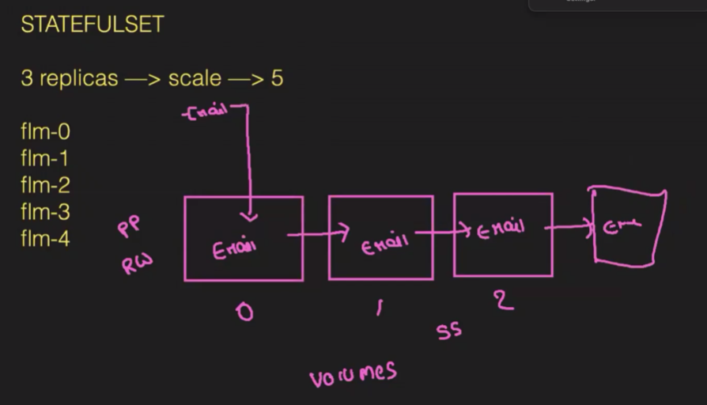

If we scale down the pods will be deleted randomly but in the statefulset the pods which are created latest will be deleted
create a manifest folder and create a yml file --> statefulset.yml
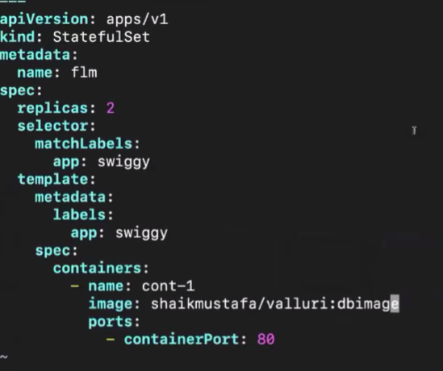
kubectl create -f statefulset.yml
Try to scale if we see in realtime --> kubectl get po -w 
it will take the latest and replicae and create a new one

To monitor we use agents so we use DeamonSet
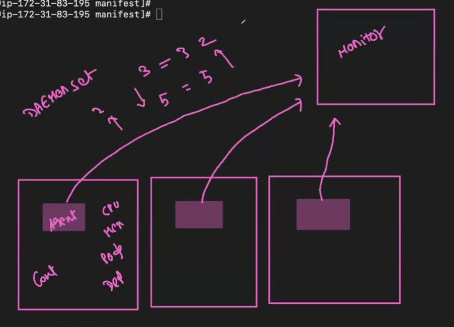
we dont have replication is this 
we cant create muliple pods for deamon set 
If the pod deleted it will created 

write a yml file 
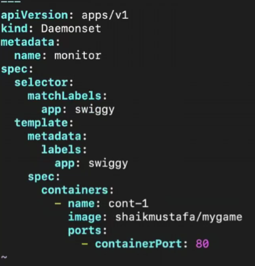 S captial
delete previous pods created --> kubectl delete statefulset flm
kubectl get pods

To change node instance micro __>> medium
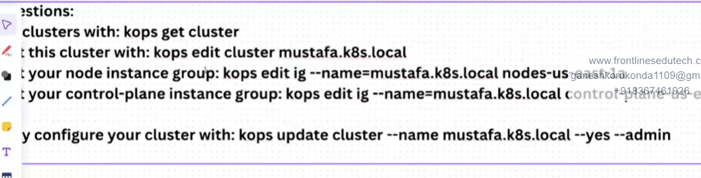
kops update cluster --name --yes --admin

