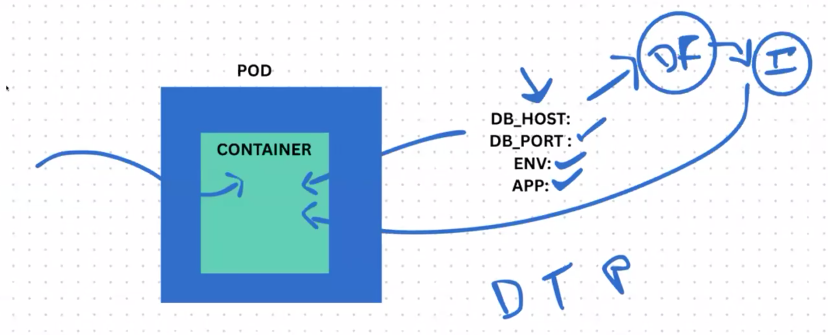
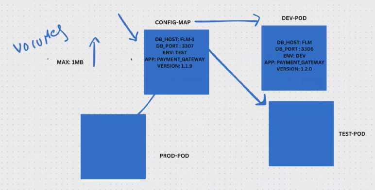
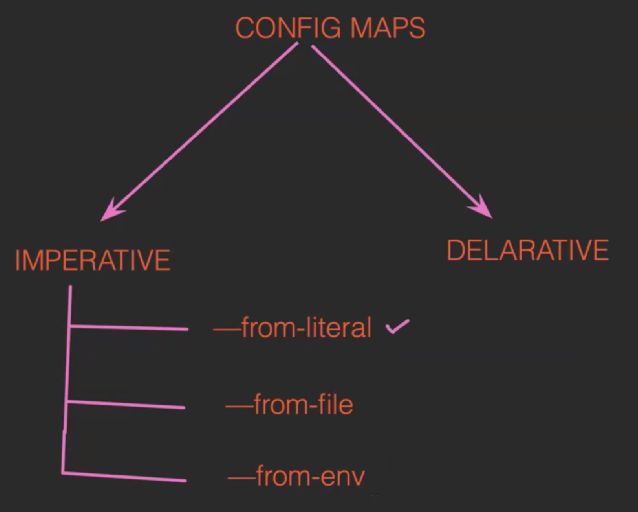
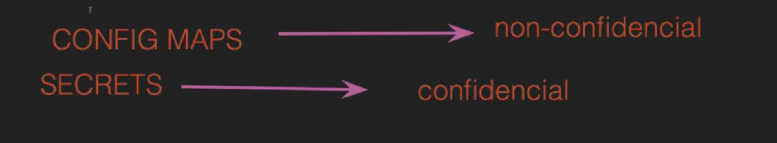
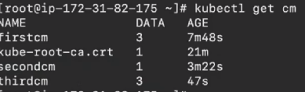
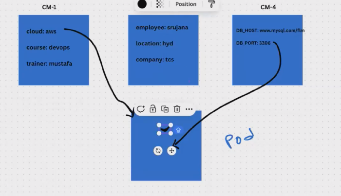
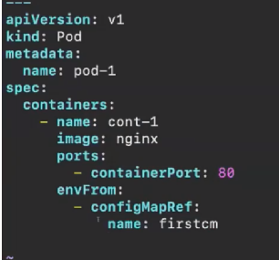
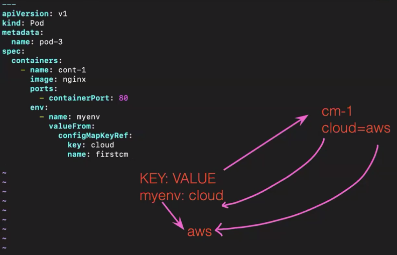
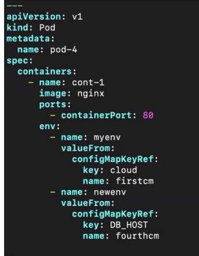

We can use minikube --> take linux, t2.micro 
Run the script using all setup script 

TOPIC: CONFIG MAPS
PODS --> containers --> run applications 

In docker how do we pass environmental variables to containers?
We use docker file component. IN this we use env and pass variables 

In k8s the values will change so we will use the configMaps concept.

CONFIG MAPS:

· ConfigMap is used to store the configuration data in key-value pairs within Kubernetes.
· But the data should be non confidential data.
· This is one of the ways to decouple the configuration from the application to get rid of hardcoded values.
· Also, if you observe some important values keep changing according to the environments such as development, testing, production, etc ConfigMap helps to fix this issue to decouple the configurations
· So we can set the configuration of data of application separately
. But it does not provider security and encryption. If we want to provide encryption use secrets in Kubernetes.
· Limit of config map data in only 1 MB (we cannot store more than that)
· But if we want to store a large amount of data in config maps we have to mount a volume or use a separate database or file service.

we can attach the config_map to dev-POD and test_POD and prod_POD by chaning values 

ConfigMap ---> 2 ways

1. Using Literal
create config Map -->kubectl create cm phanicm --from-literal=cloud=aws --from-literal=course=devops --from-literal=trainer=mustafa
kubectl get cm
To see data in cm --> kubectl describe cm phanicm

We can read all data in this so we need to pass confidentail using secrets

2. From file:
create a file --> vim myvalues
add data like --> name=mustafa
place=hyd
job_title=devops
now from this file the config need to create --> kubectl create cm secondcm --from-file=myvalues
see cm --> kubectl get cm
to see cm --> kubectl desribe cm secondcm

3. From env:
create a file with env --> vim values.env
Add data --> company=tcs
employee=srujana
location=hyd
creaete --> kubectl create cm thirdcm --from-env-file=values.env
see cm --> kubectl get cm
To see data --> cat values.env

The differnce b/n them:

delete cm --> kubectl delete cm secondcm

Declartive way--> yml
create file --> configmap.yml 
write file --> 
---
apiVersion: v1
kind: ConfigMap
metadata:
   name: fourthcm
data:
   DB_HOST: "www.mysql.com/flm"
   DB_PORT: "3306"
create --> kubectl create -f configmap.yml
see-->  kubectl get cm

Now we need to attach the config map to the POD

Now we create a POD using manifest file -->

create --> kubectl create -f pod.yml
see pods --> kubectl get po
goto container --> kubectl exec -it pod-1 -- bash
To see env --> printenv

kubectl create -f pod.yml
kubectl get po
go into pod --> kubectl exec -it pod-3 --bash
got --->printenv

now we can map diff 

we can add other also

kubectl create -f pod.yml
kubectl get po
kubectl exec -it pod-4 -- bash
printenv

In real time we use .env and manifest 
1. .env --> dev app api
2. manifest --> environment and version and team or application

