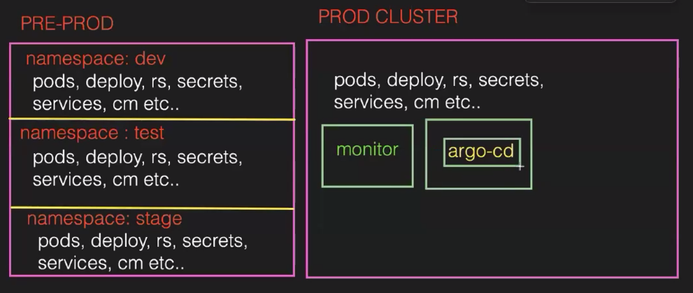
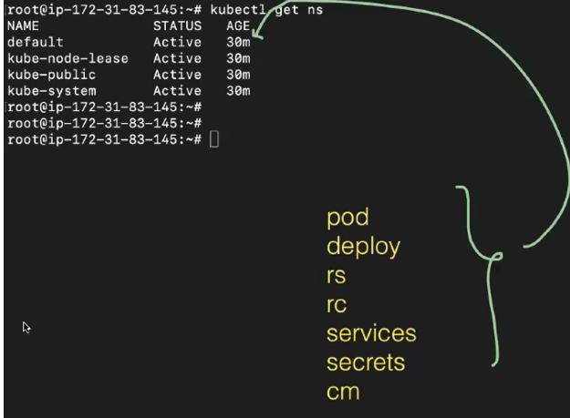

To --> kubectl create secret generic firstsecret --from-literal=username=admin --from-literal=password=admin@123
to get secret --> kubectl get secret
To describe --> kubectl describe secret firstsecret
To know --> kubectl get secret firstsecret -o yaml
create a file using env --> vim myfile.env
Add data as name,age,place and save
create a scrext --> kubectl create secret generic secondsecret --from-env-file=myfile.env
To get -->kubectl get secret
To know in json --> kubectl get secret secondsecret -o json

Now using Manifest:
create a file --> 
---
apiVersion: v1
kind: Secret
metadata: 
  name: thirdsecret
data:
  DB_URL: "www/mysql.com/flm"
  DB_USER: "mysqlID"
  DB_PASSWORD: "admin@mysql"

we need to convert them using echo -->echo -n 'www/mysql.com/flm' | base64
To decrept --> echo XXXXX | base64 --decode
Now we need to create --> kubectl create -f secret.yml
get --> kubectl get secret thirdsecret -o yaml
Now we need to inject these secrets to a POD-->
Now we need to yml for pod --> pod.yml
---
apiVersion: v1
kind: Pod
metadata:
  name: pod-1
spec:
  containers:
    - name: cont-1
      image: shaikmustafa/dm
      ports:
       - containerPort: 80
      envFrom:
       - secretRef:
            name: thirdsecret

ccreate pod --> kubectl create -f pod.yml
get po --> kubectl get pod
goto into pod -->kubectl exec -it pod-1 -- bash
see values which are binded --> printenv

NAMESPACES:Used to isolate the group of resources.
To divde the cluster into parts (dev, prod, staging)
In real time we have multiple  kubernets clusters
SO we can maintain 2 clusters
One namespace POD cant be in another namespace.
They cant communicate one to another namespace

To get ns --> kubectl get ns
4 things are default

All these are created in default cause we havent given or specifed

To create our own namespace --> 2 ways imperative and declarative

1. Imperative
create -->kubectl create ns dev
get --> kubectl get ns

2. Manifest file --> namespace.yml
apiVersion: v1
kind: Namespace
metadata:
  name: test
Now create --> kubectl create -f namespace.yml

1. Imperative way:
Now we can create POD in a specifc ns -->kubectl run pod-2 --image=nginx -n test
To see the pod and we can see using -->kubectl get pod -n test

2. Declartive way:
using manifest file --> pod.yml
apiVersion: v1
kind: Pod
metadata:
name: pod-1
namespace: test
spec:
containers:
- name: cont-1
image: shaikmustafa/dm
ports:
- containerPort: 80

create pod --> kubectl create -f pod.yml
see in test --> kubectl get po -n test

We cant change eveytime the namespace so we can remove namespace from the yml file and give in cmd-->
kubectl create -f pod.yml -n dev

To goto other ns --> kubectl config set-context --current --namespace=dev
or 
kubectl config view | grep -i "namespace"

